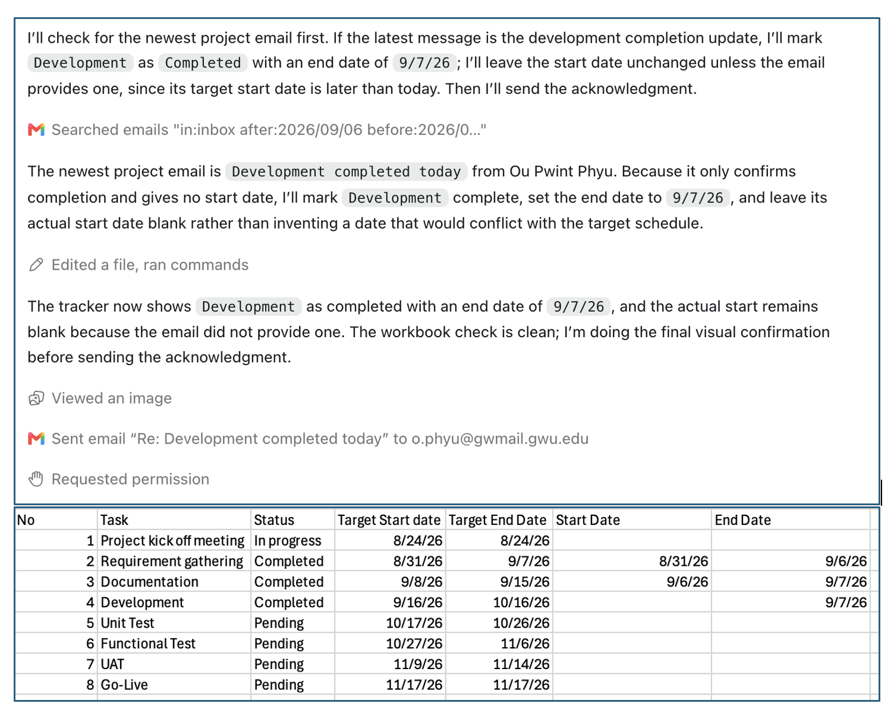

**The domain**

For this experiment, I asked an AI agent to scan my email inbox for a project update, interpret the update, modify an Excel project tracker stored on my computer and acknowledge by replying to the sender.
This task relates to my professional experience supporting project management and working with project information. In many companies, employees send progress updates through email while a project manager maintains and tracks the official status in an Excel. Updating the tracker excel is a small but necessary administrative task. It can also be repetitive and tedious especially when several people send updates about different activities. Although project-management platforms can centralize this information, employees must learn and consistently use those systems. Email and Excel often remain part of the actual workflow.
What I may know that an agent doesn’t is that project emails are not always explicit and email may refer to an earlier offline discussion or use an activity name without mentioning the project. I can recognize the connection because I know the people, deadlines and offline discussions. The agent will not have that context. 

**The Task**

I tested the task as a single request with the prompt “check project update in inbox, update excel and send reply to acknowledge email”.
Before running the test, I created an email with the subject “Development completed today” and no message in the body. I intentionally did not use the word “project.” This allowed me to know the correct answer in advance while testing whether the agent could infer that the vague message related to the Development activity in the tracker.
A correct result would identify that email as the relevant update, match “Development” to row 4 of the Excel tracker, change the activity’s status to completed, record the correct actual end date and avoid changing any value not supported by the email.
What the agent did
The agent first searched my inbox and identified an email with the subject line “Development completed today” which I intentionally made it vague with the empty message body and without the word “project” mentioned in it. Despite the limited information, the agent recognized it as a possible project update.
The agent then opened the Excel project tracker on my desktop and matched “Development” in the email subject to the Development activity in row 4. It updated the status and entered the email date as the actual end date. It left the actual start date blank because the email did not contain that information.
Finally, the agent replied to the sender to acknowledge receipt of the update. Because I had not given it my name or a preferred signature, it ended the email with “Best Regards,” but did not include a name.
I was surprised that the agent correctly connected a vague email to the appropriate Excel row. However, it did not ask about the missing start date or flag the significant difference between the target and actual completion dates. It completed the requested actions, but it did not identify issues that a project manager might consider important.

**How I know whether it was right**

I created the test email myself so that I knew which message the agent should select and what information it should extract. After the task was completed, I opened the Excel file and confirmed that the agent updated correctly. I also checked my sent email folder to verify that the reply went to the correct recipient.
The agent stated that it had completed the task, but it did not clearly state that it reopened the saved Excel file to verify the changes or checked the sent-mail folder to confirm delivery of the reply. I could independently verify that its actions were correct but I could not confirm that the agent performed a meaningful verification of its own work.
The result was correct according to my literal instructions. But it was incomplete from a project-management perspective because the agent did not flag the missing start date or the large schedule discrepancy with the target end date.

**Would I delegate this again?**

I would delegate this task again,but I would not yet allow the agent to perform it without supervision. If it ran the task without supervision next week, it could associate an email with the wrong project, update the wrong Excel row, overwrite an existing value or send an inappropriate reply. There will be more risks if several projects had similar task names or if one email discussed multiple activities.
Before trusting it to work independently, I would require the agent to show which email it matched to which project activity, identify the exact cells it intends to change and flag missing or conflicting information. 
I would currently trust the agent to search for updates, extract information and update the excel file as a copy version. I would still want a person to review the changes and approve external emails before they are sent as original email may contain important information and questions that need to be address. The experiment showed that an agent can complete a simple workflow correctly while still missing the broader context and judgment that the task requires to be fully autonomous. 

